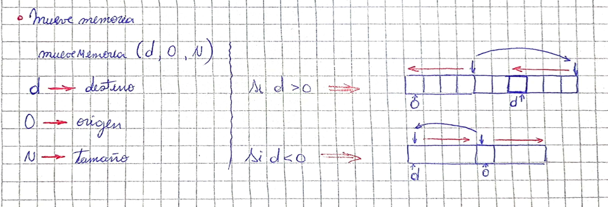
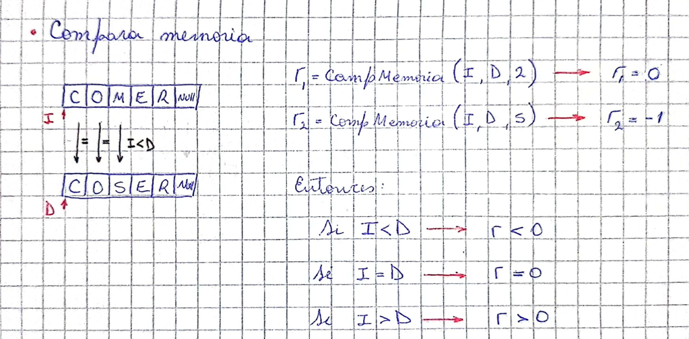
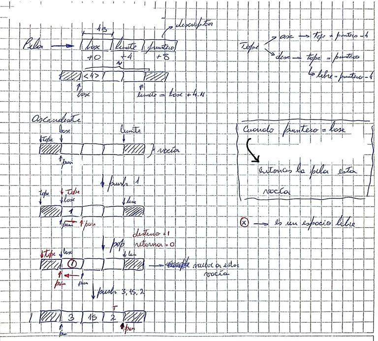
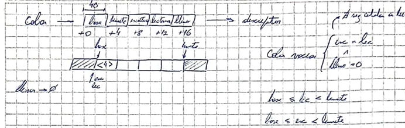
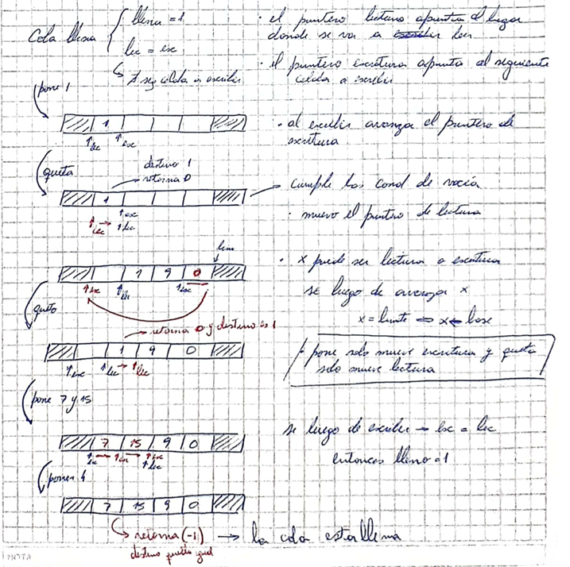
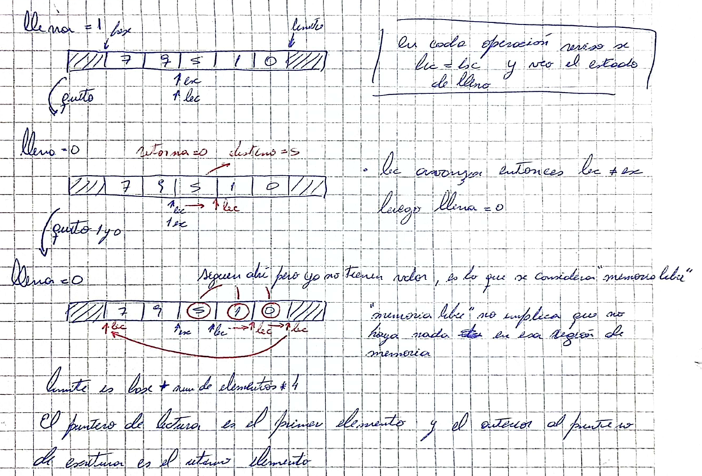

# Memoria técnica - Estructuras de datos en ensamblador de un procesador ARMv7M

Electrónica IV - TP - Estructuras de datos en ensamblador de un procesador ARMv7M

### ***Juarez, Gustavo Leonel***

## Objetivos

> Aquí explica de forma resumida de que se trata el práctico y lista los
> ejercicios que vas a desarrollar.
>
> A partir de aquí documentarás para cada ejercicio tu proceso de diseño, lo que
> será de utilidad para razonar sobre como llegaste a un resultado, por qué
> se cometieron errores (en caso que haya ocurrido) y como podrías mejorarlo
> para llegar a buenos resultados de forma más eficiente. Si bien el contenido
> del trabajo irá evolucionando, es importante que cuando encuentres un problema
> o te "trabes" durante el proceso, escribas una nota.  
> *Sugiero conservar estas instrucciones durante el desarrollo, posiblemente
> en forma impresa, para poder referirte a ellas como guía mientras trabajas*
>

## Mueve memoria

Hay dos regiones contiguas de memoria, posiblemente solapadas, de igual cantidad
de bytes. Estas regiones las llamaremos *origen* y *destino*. Debes copiar los
valores de *origen* en *destino*. Si las regiones se solapan, *destino* debe
tener al terminar una copia íntegra de los datos (en ese caso *origen* ya no
la tendrá, por eso es mover y no copiar). Tu solución será en la forma de la
función `mueveMemoria` cuyo uso se ejemplifica en el Listado 1. Ubica tu
solución en `lib/ops_memoria/mueve.S`.

Listado 1: Prototipo de la funcion `mueveMemoria`  

```c
#include "serie.h"

#include "ops_memoria.h"

/* En ops_memoria.h
void mueveMemoria(void *destino,const void *origen, size_t tamano);
*/ 

static char origen[] = "Hola Mundo12345";

void listado_1(void){
    const size_t tamano = 4+1+5; // Cantidad de caracteres en "Hola Mundo"
    mueveMemoria(origen+5,origen,tamano);
    Serie_enviaCadena(origen); // Transmite "Hola Hola Mundo"
    Serie_enviaNuevaLinea();
    mueveMemoria(origen,origen+5,tamano);
    Serie_enviaCadena(origen); // Transmite "Hola MundoMundo"
    Serie_enviaNuevaLinea();
}
```

### Análisis del problema

Para resolver el problema, primero hay que determinar como copiar los datos de origen en destino pues dependiendo de donde
se encuentre este se copiará desde izquierda a derecha o al reves, esto determina como se recorreran. Por ello si destino 
se encuentra antes que origen se debe copiar los datos de izquierda a derecha. En caso de que destino este ubicado despues
de origen entonces debo copiar los datos de derecha a izquierda.


Entonces para comenzar determinamos de que forma se copiaran los datos, si de izquierda a derecha o al reves. Para ello se 
utiliza el siguiente codigo:

```asm
    cmp     r0, r1                      // Compara los punteros de origen y destino
    beq     fin                         // Si ambos son iguales salta a "fin"
    blo     copia_desde_inicio          // Si r0 es menor que r1 entonces copio de izquierda a derecha
    bhi     copia_desde_final           // Si r0 es mayor que r1 entonces copio de derecha a izquierda
```

Donde las etiqueta de `copia_desde_inicio` y `copia_desde_final` representan saltos que determinarán como se realizaran las
diferentes forma de escritura.

Para poder copiar desde izquierda a derecha se recorre el registro, en este caso será r3, en dicha direccion. Para lograr
esto se suma un byte cada vez que se produce un salto a `copia_desde_inicio`:

```asm
copia_desde_inicio:
    ldrb    r3, [r1], #1                // Carga el byte desde el origen y actualiza el puntero
    strb    r3, [r0], #1                // Almacena el byte en el destino y actualiza el puntero
    subs    r2, #1                      // Decrementa la longitud
    bne     copia_desde_inicio
    b       fin
```

En cambio para poder copiar desde derecha a izquierda primero nos debemos ubicar en la posicion desde la cual queremos copiar,
esta estará dada por el tamaño de la palabra, entonces primero debemos ubicarnos al final de la palabra que queremos copiar
esto se realiza en `copia_desde_final`. Luego  debemos disminuir el tamaño en un byte cada vez que se produce un salto a 
`copia_desde_final_loop`:

```asm
copia_desde_final:
    add     r1, r2                      // Ajusta los punteros al final de las regiones
    add     r0, r2

copia_desde_final_loop:
    ldrb    r3, [r1, #-1]!              // Carga el byte desde el origen y actualiza el puntero
    strb    r3, [r0, #-1]!              // Almacena el byte en el destino y actualiza el puntero
    subs    r2, #1                      // Decrementa la longitud
    bne     copia_desde_final_loop
```
### Solución
``` asm
mueveMemoria:
    // r0 -> Destino 
    // r1 -> Origen
    // r2 -> Longitud de la palabra

    cmp     r0, r1                      // Compara los punteros de origen y destino
    beq     fin                         // Si ambos son iguales salta a "fin"
    blo     copia_desde_inicio          // Si r0 es menor que r1 entonces copio de izquierda a derecha
    bhi     copia_desde_final           // Si r0 es mayor que r1 entonces copio de derecha a izquierda

copia_desde_inicio:
    ldrb    r3, [r1], #1                // Carga el byte desde el origen y actualiza el puntero
    strb    r3, [r0], #1                // Almacena el byte en el destino y actualiza el puntero
    subs    r2, #1                      // Decrementa la longitud
    bne     copia_desde_inicio
    b       fin

copia_desde_final:
    add     r1, r2                      // Ajusta los punteros al final de las regiones
    add     r0, r2

copia_desde_final_loop:
    ldrb    r3, [r1, #-1]!              // Carga el byte desde el origen y actualiza el puntero
    strb    r3, [r0, #-1]!              // Almacena el byte en el destino y actualiza el puntero
    subs    r2, #1                      // Decrementa la longitud
    bne     copia_desde_final_loop

fin:
    bx lr
```
## Compara memoria

Dadas dos regiones de memoria de igual tamaño, que llamaremos *izquierda* y
*derecha*, compara sus contenidos byte a byte como valores *sin signo* y retorna
un valor entero. El valor retornado será $0$ si los contenidos de las regiones
son *iguales*, $-1$ si el primer byte distinto es *menor* en *izquierda* que en
*derecha* y $1$ si el primer byte distinto es *mayor* en *izquierda* que en
*derecha*. Tu solución será en la forma de la función `comparaMemoria` cuyo uso
se ejemplifica en el Listado 2. Ubica tu solución en `lib/ops_memoria/compara.S`

Listado 2:

```c
#include <stdint.h>
#include "serie.h"

#include "ops_memoria.h"

/* Prototipo en ops_memoria.h
int comparaMemoria(const void *izquierda,const void *derecha, size_t tamano);
*/

uint8_t a1[]={0,1,2,3};
uint8_t a2[]={0,1,3,5};
uint8_t a3[]={0,1,2,3};
size_t tamano = 4;

void listado_2(void){
    const int comp1 = comparaMemoria(a1,a3,tamano);
    const int comp2 = comparaMemoria(a1,a2,tamano);
    const int comp3 = comparaMemoria(a2,a3,tamano);
    Serie_enviaEntero(comp1); // envia "0"
    Serie_enviaNuevaLinea();
    Serie_enviaEntero(comp2); // envia "-1"
    Serie_enviaNuevaLinea();
    Serie_enviaEntero(comp3); // envia "1"
    Serie_enviaNuevaLinea();
}
```

### Análisis del problema
Para lograr resolver el ejercicio se debe tener en cuenta que la comparacion de las regiones de memoria se realiza byte a byte,
es decir, voy comparando los byte mientras recorro los registros `Izquierda` y `derecha`. Luego la funcion deberá retornar un
valor segun lo siguiente:
* Si *`Izquierda`* es igual que *`derecha`* se retornará *0*
* Si *`Izquierda`* es menor que *`derecha`* se retornará *-1*
* Si *`Izquierda`* es mayor que *`derecha`* se retornará *1*


### Solución

```asm
comparaMemoria:
        /*
        * r0 -> Izquierda
        * r1 -> Derecha
        * r2 -> Tamaño
        */
compara:
        ldrb    r3,  [r0], #1           // Cargo el byte desde Izquierda y actualizo el puntero.
        ldrb    r12, [r1], #1           // Cargo el byte desde Derecha y actualizo el puntero.

        cmp     r3, r12                 // Comparo los punteros de Izquierda y Derecha.
        blo     izquierda               // Si Izquierda es menor que derecha entonces salta a la etiqueta.
        bhi     derecha                 // Si Izquierda es mayor que derecha entonces salta a la etiqueta.
        subs    r2, #1                  // Decremento la longitud de la palabra
        bne     compara                 // Mientras r2 sea distinto de cero salto a compara y continuo el loop

        mov     r0, #0                  // Retorna 0
        b       fin

izquierda:
        mov     r0, #-1                 // Retorna -1
        b       fin

derecha:
        mov     r0, #1                  // Retorna 1

fin:
        bx      lr
```

## Arreglo
En este problema nos ocuparemos de representar un arreglo mediante un tipo de
datos estructurado o registro (struct de lenguaje C) que contiene la información
necesaria para operar sobre el mismo. El elemento que describe al arreglo se
llamará *descriptor*. Definiremos funciones que implementan una interfaz
uniforme de acceso al arreglo en base a un descriptor. Dicha interfaz contiene
las siguientes operaciones:

- Inicializar un descriptor de arreglo
- Obtener un puntero a un elemento del arreglo
- Leer un elemento del arreglo
- Escribir un elemento del arreglo
- Intercambiar los valores de dos elementos del arreglo

```c
typedef struct Arreglo{
    void *base;
    int32_t tamanoElemento;
    int32_t numElementos;
}Arreglo;

/**
 * @brief Inicializa un descriptor que describe un arreglo con una direccion de
 * memoria base, tamaño de elemento y número de elementos dados
 * 
 * @param descriptor Puntero al descriptor a inicializar 
 * @param base Dirección base del arreglo
 * @param tamanoElemento Tamaño del elemento
 * @param numElementos Número de elementos
 */
void Arreglo_init(Arreglo *descriptor, void *base,
                  int tamanoElemento, int numElementos);

/**
 * @brief Retorna un puntero a un elemento del arreglo descrito
 * 
 * @param descriptor Descriptor de arreglo inicializado con Arreglo_init
 * @param indice
 * @return void* Puntero al elemento indicado por indice, NULL si no existe el
 * elemento (NULL es la dirección 0)
 */
void *Arreglo_apunta(Arreglo *descriptor, int indice);

/**
 * @brief Lee el valor de un elemento del arreglo descrito, copiándolo en el
 * espacio de memoria proporcionado. Supone que la región de memoria tiene
 * tamaño suficiente
 * 
 * @param descriptor Descriptor del arreglo
 * @param indice Índice del elemento a leer
 * @param destino Puntero a la regió de memoria donde copiar el valor
 * @return int 0 si la operación pudo realizarse, -1 si el elemento no existe
 */
int Arreglo_lee(const Arreglo *descriptor, int indice, void *destino);

/**
 * @brief Escribe el valor proporcionado en el arreglo descrito
 * 
 * @param descriptor Descriptor de arreglo
 * @param indice Índice del elemento a escribir
 * @param origen Puntero a región conteniendo los datos a escribir
 * @return int 0 si efectuó la operación, -1 si no existe el elemento en el
 * arreglo
 */
int Arreglo_escribe(Arreglo *descriptor, int indice, const void *origen);

/**
 * @brief Intercambia los valores de dos elementos del arreglo
 * 
 * @param descriptor Descriptor de arreglo
 * @param indice_1 Primer índice
 * @param indice_2 Segundo índice
 * @return int 0 si tuvo exito, -1 si algún elemento no existe
 */
int Arreglo_intercambia(Arreglo *descriptor, int indice_1, int indice_2);
```

### Análisis del problema

### 1. Arreglo_Init:

Antes de comenzar a realizar las funciones debemos establecer el descriptor del arreglo, el cual definirá los parametros
del mismo. Estos son:
- Base: es la dirección a la que se encuentra el primer elemento.
- Tamaño de elementos: es la cantidad maxima de elementos que puedo almacenar.
- Numero de elementos: es la cantidad de elementos que se tiene.

"figura hecha a mano INIT"

### 2. apunta


### Solución

***La solución está en lib/arreglo/arreglo.S***

## Pila

Una pila es una estructura de datos que permite guardar y recuperar información
de modo que el primer dato guardado es el último recuperado (por su sigla en
ingles LIFO, Last In First Out). Una pila implementa las operaciones *push* y
*pop*. La operación *push* ingresa un dato en la pila, mientras que la operación
*pop* quita el último dato ingresado de la pila y retorna su valor.
En este problema implementaremos una pila de enteros de 32 bit. La información
sobre la memoria reservada y el estado de la pila se mantendrán en un
descriptor.

```c
typedef struct Pila{
    int32_t *base; // Primera posición de la memoria reservada
    int32_t *limite; // Dirección de la primera posición inválida de memoria
    int32_t *puntero; // Dirección del último dato insertado con push
}Pila;

/**
 * @brief Inicializa un descriptor de pila. Inicialmente la pila está vacía
 * 
 * @param descriptor Descriptor a inicializar
 * @param base Dirección base (menor dirección) de la pila
 * @param capacidad Capacidad de la pila (en elementos)
 */
void Pila_init(Pila *descriptor, int32_t *base, size_t capacidad);

/**
 * @brief Ingresa un valor en la pila descrita
 * 
 * @param descriptor Descriptor de pila
 * @param valor Valor a ingresar
 * @return int 0 si la operación se realizó, -1 si la pila estaba llena
 */
int Pila_push(Pila *descriptor, int32_t valor);

/**
 * @brief Quita el último elemento de la pila descrita y copia su valor en
 * destino
 * 
 * @param descriptor Descriptor de pila
 * @param destino Dirección de la variable de destino
 * @return int 0 si la operación se realizó, -1 si la pila estaba vacía
 */
int Pila_pop(Pila *descriptor, int32_t *destino);
```
### Análisis del problema
La `Pila` es una estructura tipo LIFO (Last In First Out), en la cual los datos que van entrando se van "apilando" uno sobre el otro
y las unicas funciones que se pueden realizar en esta son agregar un dato(`push`) y quitar el dato (`pop`).El descriptor de esta 
estructura esta formado 3 parametros, donde cada uno ocupa 4 bit:
***Base(0):*** es la direccion del primer elemento de memoria.
***Limite(4):*** es la direccion del ultimo elemento de memoria.
***puntero(8):*** es la direccion del ultimo dato ingresado.
Para saber cuando la pila esta llena o vacía debemos tener en cuenta donde se encuentra el puntero, por lo tanto:
* La `Pila` está vacía si $puntero = base$.
* La `Pila` está llena si $puntero = limite$

*Nota: esto solo vale si la `Pila` es ascendente pues si es descendente se debe tener en cuenta el concepto de `tope`. Este se encuentra en un lugar anterior al puntero y se puede utilizar para saber cuando la `Pila` esta llena.*

### Solución

## Cola

Una cola es una estructura de datos que permite almacenar temporalmente
información para un posterior uso. A diferencia de una pila, en una cola el
primer dato en entrar será también el primero en salir (por su sigla en inglés
FIFO, First In First Out). Las colas son utilizadas para almacenar datos en
espera a ser procesados, de forma similar a cuando hacemos cola en una
ventanilla para hacer un trámite. En este problema implementarás una cola de
enteros de 32 bit que soporte las siguientes operaciones:

- *pone*: Pone un nuevo elemento en la cola
- *quita*: Quita el elemento más antiguo de la cola, retornando su valor

```c
typedef struct Cola {
    /**
     * @brief Dirección de la primera posición de la memoria reservada
     */
    int32_t *base;

    /**
     * @brief Dirección de la posición siguiente a la última posición reservada 
     */
    int32_t *limite;

    /**
     * @brief Dirección de la posición donde se va a escribir el proximo dato
     */
    int32_t *pEscritura;
    
    /**
     * @brief Dirección de la posición del dato más antiguo no leído 
     */
    int32_t *pLectura; 

    /**
     * @brief Indica cola llena, cuando pEscritura == pLectura, 1 indica cola
     * llena y 0 indica cola vacía.
     * 
     * @note el tipo bool se implementa como entero de 8 bit pero solo puede
     * contener valores 0 y 1
     */
    bool llena;
}Cola;

/**
 * @brief Inicializa un descriptor de cola
 * 
 * @param descriptor Descriptor
 * @param base Dirección base de memoria
 * @param tamano Tamano de memoria para la cola
 */
void Cola_init(Cola *descriptor, int32_t *base,int tamano);

/**
 * @brief Pone un nuevo valor en cola.
 * 
 * @param descriptor Descriptor de cola
 * @param valor Valor a introducir
 * @return int 0 si la operación fue exitosa. -1 si la cola estaba llena.
 */
int Cola_pone(Cola *descriptor, int32_t valor);

/**
 * @brief Quita el elemento más antiguo de la cola y escribe su valor en 
 * destino.
 * 
 * @param descriptor Descriptor de cola
 * @param destino Puntero a variable donde guardar el valor quitado
 * @return int 0 si la operación tuvo éxito. -1 si la cola estaba vacía.
 */
int Cola_quita(Cola *descriptor, int32_t *destino);
```
### Análisis del problema
La `Cola` es una estructura similar a la pila pero el primer dato en entrar es el primero en salir (FIFO, First In First Out),
ademas su forma de operar se considera un buffer circular, es decir, una vez que uno de los punteros llega al limite de la `Cola` 
y si se puede ingresar mas datos en ésta la dirección que tomará el puntero será la de base. El descriptor de la `Cola` esta formado 
por 5 parametros los cuales cada uno es de 4 bits:
- ***Base (0):*** es la direccion del primer elemento de memoria.
- ***Limite (4):*** es la direccion del ultimo elemento de memoria (en cantidad de elementos).
- ***Escritura (8):*** es el puntero que indica el siguiente lugar a escribir (la posición anterior a este es el ultimo elemento).
- ***Lectura (12):*** es el puntero que indica el siguiente elemento a leer (la posicion del puntero indica el primer elemento de la `Cola`).
- ***Lleno (16):*** indica el estado en el que se encuentra la `Cola`.



El funcionamiento de la `Cola` se basa en *Poner* y *Quitar* elementos de la misma. Para ello utilizamos los punteros de lectura 
(`lec`) y escritura (`esc`), cuando se pone un elemento en la `Cola` se carga el dato y `esc` se mueve a la derecha, de la misma 
forma cuando se quita un elemento `lec` se mueve a la derecha. Al quitar un elemento la "casilla" la `Cola` retorna el valor leído 
y donde estaba ubicado queda un espacio de *"memoria libre"*, donde no es que se borra el dato que habia sino que ya no tiene un 
significado y puede ser sobrescrito.

El estado de la `Cola` esta definido, no solo por ***Lleno*** sino que tambien se debe cumplir que los punteros de escritura y lectura coincidan.

* La `Cola` esta vacía si: $lleno = 0$ y $lec = esc$
* La `Cola` esta llena si: $lleno = 1$ y $lec = esc$

 

### Solución

> ### Notas
>
> Incluye aquí notas describiendo tu experiencia en la solución del ejercicio.
> En casos simples puede que no tengas nada que añadir y en esos casos puedes
> omoitirlo. Debe figurar aquí una nota por cada problema o dificultad que te
> sorprendió o causó que te "trabes", busques ayuda o dediques más de 5' de
> razonamiento a entender como y por qué ocurre algo distinto a lo esperado.
>
> ### Referencias
>
> Incluye aquí referencias a los recursos que utilizaste durante tu proceso de
> diseño, las mismas deben haber sido *citadas* en estilo *APA* en el punto
> del desarrollo donde las utilizaste.
> *NOTA* Es prácticamente imposible que hayas completado un ejercicio sin
> necesidad de consultar ninguna referencia (libro, video, ejemplo en internet,
> etc.) y es importante que las incluyas aquí en el momento mismo que las
> consultes. Si una referencia resulto guiarte de forma erronea, inclúyela y
> citala en la correspondiente nota que explique lo ocurrido.
>
